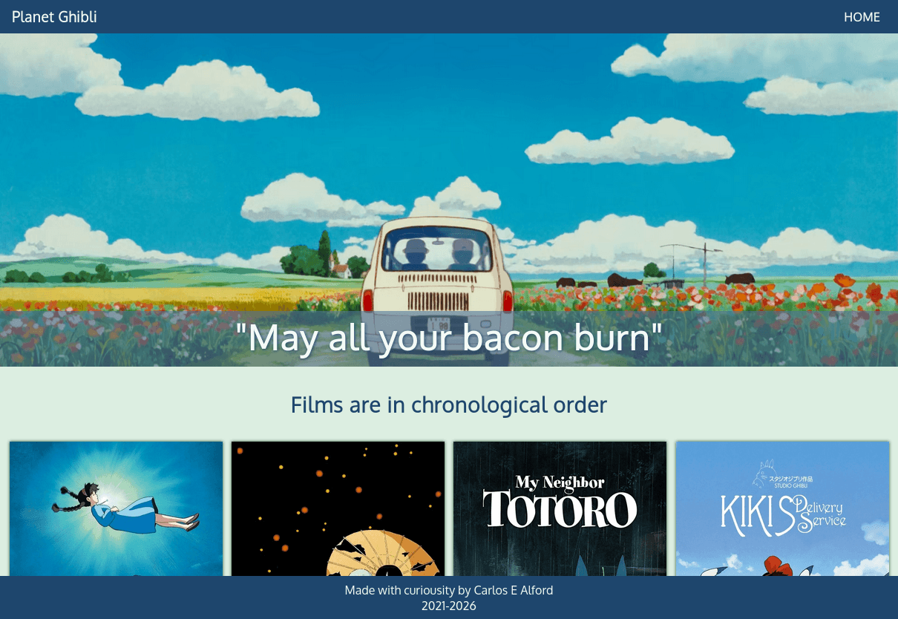

# Planet Ghibli :earth_americas:

A site to explore the world Ghibli. From characters to vehicles and places.

:earth_americas: [Visit my Ghibli](https://carlosealford.github.io/planet-ghibli/index.html) 

## About

Ghibli films pull at my imagination strings and when I ran into this API the oppportunity was to delicous to pass.

Used it as a chance to practice the `MVC`, Model, View, and Controller approach with Webpack.



## Tech stack

**Frontend:**

- HTML5
- CSS
- JavaScript

**Backend:**

- Webpack
- Express to run local server
- nodemon restarts server when changes are made to server-side code
- NPM
- Studio Ghibli API

## Run Locally

1. Clone the project

```bash
git clone https://github.com/carlosealford/planet-ghibli.git
```

2. Go to the project directory

```bash
cd planet-ghibli
```

3. Install dependencies

```bash
npm install
```

4. Build the project locally

```bash
npm run build
```

5. Start the server

- listens to changes to javascript files and stylesheets only.
- to view HTML changes you have to manually reload the browser.

```bash
npm run dev
```

## Features

- Mobile friendly
- Use of modals

## Roadmap

### MVP

- [X] Home page that shows all the films in chronological order
- [X] Each film is a link to further details about the film
- [X] Film details page
- [X] Film information release date, running time, director, and producer
- [X] Modals to showcase the film people, species, locations and vehicles

### Version 1.1.0

- [X] Redesign wireframes to improve layout of film details
- [X] Udpate API dataflow diagram
- [x] Design `MVC` dataflow for `Home` page
- [X] Design `MVC` dataflow for `Film` page
- [ ] Modernise `JS` codebase with `TypeScript`
- [ ] Make sure `HTML` is modern and accessible
- [ ] Modernise `CSS` to use latest features
- [ ] Create and include favicon
- [ ] Handle API loading error with discreat UI messages
- [ ] Customise scrollbar
- [ ] Implement loading spinner to hide text content while it render. currently you can see the text before the UI renders

## Authors

- [Carlos E Alford](https://carlosealford.com)

## Acknowledgements

- [Studio Ghibli API](https://ghibliapi.vercel.app/)
- [Webpack](https://webpack.js.org/)

## License

[GNU](LICENSE)
