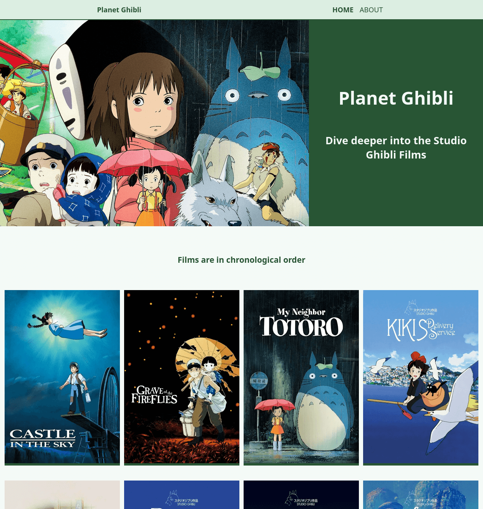

# Planet Ghibli

A site to explore the world Ghibli. From characters to vehicles and places.

## Features

- Mobile friendly
- You can 

## Tech stack

- HTML5
- CSS
- JavaScript
- Webpack
- NPM
- Studio Ghibli API

## Screenshots

## Color reference

| Color             | Hex                                                                |
| ----------------- | ------------------------------------------------------------------ |
| Almost white |  #f4faf6 |
| Honeydew |  #dceee1 |
| Jade |  #50A967 |
| Cal poly green|  #285534 |
| ucla blue |  #4F759B |
| Ultra violet |  #5D5179 |

## Key takeaways

I have neve had the need to use webpack and I can see the appeal but the initial setup is a bit long winded.
However once it is setup I do like how you can tell it in which order to pip through each step required for the project.
You can lint, before minifiying and then creating the files required to launch the site. The separation of concerns is lovely.

The other topic I practice is MVC, Model, View, and Controller framework. Another way to separate concerns.
It focuses on seprating the app data storage from presentation and user actions.

## Roadmap

**MVP**
- Home page that shows all the films in chronological order
- Each film is a link to further details about the film
- Film details page
- Film information release date, running time, director, and producer
- Modals to showcase the film people, species, locations and vehicles

## Authors

- [Carlos E Alford](https://carlosealford.com)

## Acknowledgements

- [Studio Ghibli API](https://ghibliapi.vercel.app/)
- [Webpack](https://webpack.js.org/)

## License

